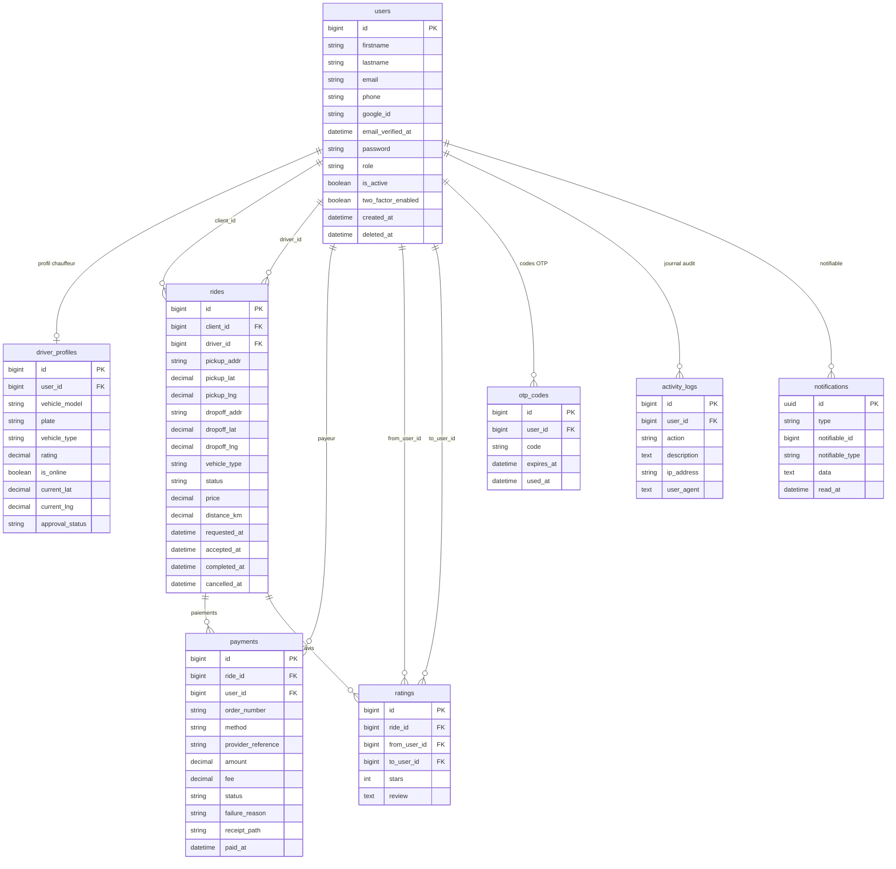

# Schéma de base de données — KinTaxiBooking

> Modèle relationnel normalisé. Toutes les tables sont créées via **migrations Laravel** (`database/migrations/`).

## Diagramme entité-relation



> **Note Mermaid :** les libellés de relation sont entre guillemets car Mermaid réserve certains mots (`to`, `from`, etc.). Une seule contrainte (`PK`, `FK` ou `UK`) est autorisée par attribut. L’attribut `review` dans le diagramme correspond à la colonne `comment` en base. Les index uniques et les `enum` sont détaillés dans les tableaux ci-dessous.

## Tables principales

### `users`

Comptes de la plateforme (admin, chauffeur, client).

| Colonne | Type | Description |
|---------|------|-------------|
| `role` | enum | `admin`, `driver`, `client` |
| `is_active` | boolean | Désactivation par l'admin |
| `two_factor_enabled` | boolean | 2FA OTP par e-mail |
| `google_id` | string | Lien OAuth Google (nullable) |
| `email_verified_at` | timestamp | Vérification d'e-mail |

### `driver_profiles`

Profil métier du chauffeur (relation 1–1 avec `users` où `role = driver`).

| Colonne | Type | Description |
|---------|------|-------------|
| `is_online` | boolean | Disponible pour de nouvelles courses |
| `current_lat/lng` | decimal | Position GPS pour le suivi |
| `approval_status` | enum | `pending`, `approved`, `rejected` |

### `rides`

Course de taxi — entité centrale du CRUD.

| Statut | Signification |
|--------|---------------|
| `pending` | En attente d'un chauffeur |
| `assigned` | Chauffeur assigné |
| `approche` | Chauffeur en route vers le client |
| `course` | Trajet en cours |
| `completed` | Terminée |
| `cancelled` | Annulée |

Référence publique affichée : `KTB-{id}` (ex. `KTB-42`).

### `payments`

Transactions Mobile Money via Labyrinthe.

| Colonne | Type | Description |
|---------|------|-------------|
| `order_number` | string | Référence interne unique |
| `method` | enum | `mpesa`, `airtel`, `orange`, … |
| `fee` | decimal | Commission Labyrinthe |
| `receipt_path` | string | Chemin du PDF généré |
| `status` | enum | `pending`, `success`, `failed` |

### `ratings`

Avis laissés après une course (étoiles + commentaire).

### `otp_codes`

Codes à usage unique pour la double authentification (hashés, expiration + `used_at`).

### `activity_logs`

Journal d'audit des actions importantes (connexion, courses, paiements, modération).

### `notifications`

Notifications Laravel (cloche) — colonnes polymorphes `notifiable`.

## Tables système Laravel

| Table | Usage |
|-------|--------|
| `sessions` | Sessions web (driver `database`) |
| `password_reset_tokens` | Réinitialisation mot de passe |
| `cache`, `jobs` | Cache et files d'attente |
| `notifications` | Notifications BDD |

## Relations Eloquent (résumé)

```
User
 ├── hasOne  DriverProfile
 ├── hasMany Ride (client_id)
 ├── hasMany Ride (driver_id)
 ├── hasMany Payment
 ├── hasMany OtpCode
 └── hasMany ActivityLog

Ride
 ├── belongsTo User (client, driver)
 ├── hasMany Payment
 └── hasMany Rating
```

## Seeders

`DatabaseSeeder` crée :

- 1 admin, 1 chauffeur test (en ligne), 1 client test
- 7 chauffeurs + 14 clients supplémentaires
- ~30 courses avec paiements et notes
- Courses terminées non payées (client test, 100 FC) pour tester le paiement
- Courses `pending` et `cancelled` pour les filtres

```bash
php artisan migrate:fresh --seed
```
